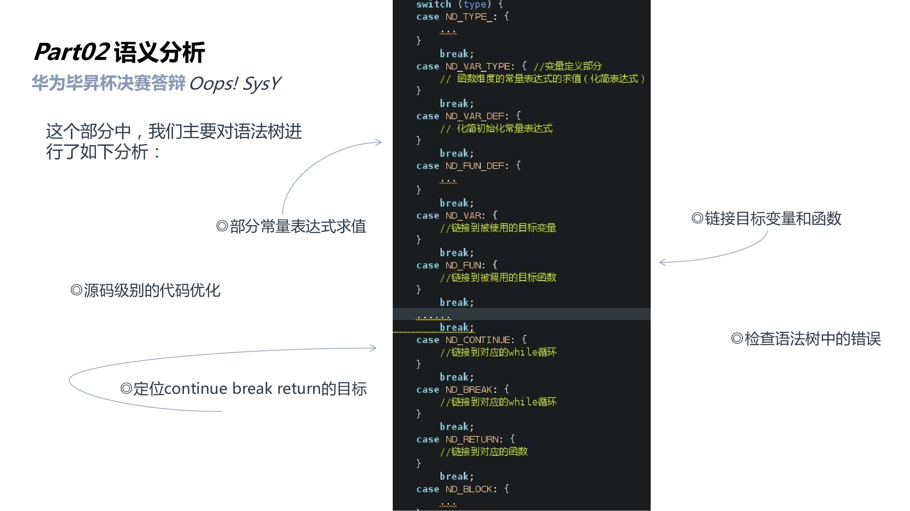

[![MIT License][license-shield]][license-url]


<br />
<p align="center">
  <a href="https://github.com/DaviesGit">
    
  </a>

  <h3 align="center">Maked by Davies</h3>

  <p align="center">
    Email: 1182176003@qq.com
<!--     <br />
    <a href="https://github.com/DaviesGit"><strong>Explore the docs »</strong></a>
    <br />
    <br />
    <a href="javascript:void(0)">View Demo</a>
    ·
    <a href="javascript:void(0)">Report Bug</a>
    ·
    <a href="javascript:void(0)">Request Feature</a> -->
  </p>
</p>


<!-- TABLE OF CONTENTS -->
## Table of Contents

* [About the Project](#about-the-project)
  * [Built With](#built-with)
* [Getting Started](#getting-started)
  * [Prerequisites](#prerequisites)
  * [Installation](#installation)
* [Usage](#usage)
* [功能定制](#功能定制)
* [Roadmap](#roadmap)
* [Contributing](#contributing)
* [License](#license)
* [Contact](#contact)
* [Acknowledgements](#acknowledgements)
* [免责声明](#免责声明)

<!-- ABOUT THE PROJECT -->

## About The Project

运行结果：（其中有一个样例是RE，可能是由于我们函数合并的优化没有考虑数组传入的情况）

[![Product Name Screen Shot][product-screenshot00]](https://github.com/DaviesGit)

编译器一共包括`词法分析`、`语法分析`、`语义分析`、`优化`、`目标代码`等6个部分。


语法树结构部分：


词法分析部分：


语法分析部分：


语义分析部分：



目标代码生成部分：


代码优化部分：


系统架构：


SysY 语言是 C 语言的一个子集。每个 SysY程序的源码存储在一个扩展名为 sy 的文件中。该文件中有且仅有一个名为 main的主函数定义,还可以包含若干全局变量声明、常量声明和其他函数定义。SysY语言支持 int 类型和元素为 int 类型且按行优先存储的多维数组类型,其中 int 型整数为 32 位有符号数;const 修饰符用于声明常量。

详细的SysY语言定义请参考`SysY语言定义.pdf`、`SysY运行时库.pdf`。

该编译器主要用来将SysY语言编译为arm汇编指令，并且对编译生成的代码进行优化。

功能:
* 词法分析
* 语法分析
* 语义分析
* 目标代码
* 优化

> 1. 对常量表达式进行化简求值
> 2. 合并冗余的函数调用
> 3. 高频访问的变量使用寄存器优化，减少内存访问。
> 4. 合并arm代码中不必要的mov指令。
> 5. 将函数内联进代码中，减少函数调用开销。
> 6. 更多


### Built With
依赖
* [CMake](https://cmake.org/)

- [Make - GNU Project - Free Software Foundation - GNU.org](https://www.gnu.org/software/make/)

- [GCC, the GNU Compiler Collection - GNU Project - Free ...](https://gcc.gnu.org/)


<!-- GETTING STARTED -->

## Getting Started

这个章节将指导你简单的部署和使用该软件。

### Prerequisites

这个项目的依赖安装步骤在下面给出。
* [CMake](https://cmake.org/)
```sh
sudo apt-get install cmake
```

- [Make - GNU Project - Free Software Foundation - GNU.org](https://www.gnu.org/software/make/)

```sh
sudo apt-get install make
```

- [GCC, the GNU Compiler Collection - GNU Project - Free ...](https://gcc.gnu.org/)

```sh
sudo apt-get install gcc
```


### Installation

1. 进入项目根目录
```
cd /path/to/your/project
```

2. 在shell中运行一下代码进行编译

```sh
mkdir build
cd build
rm CMake* cmake_install.cmake Makefile compiler -r;
cmake ../ && make VERBOSE=1
```

3. 在build文件夹中会生成一个compiler可执行文件。


<!-- USAGE EXAMPLES -->

## Usage

1. 编译sy文件不进行优化
```sh
compiler ‘输入文件.sy’ -S -o ‘输出文件.s’
```

2. 编译sy文件进行O2优化

```sh
compiler ‘输入文件.sy’ -S -o ‘输出文件.s’ -O2
```


## 

## 功能定制

如果需要功能定制，请联系作者 [1182176003@qq.com](1182176003@qq.com)


<!-- ROADMAP -->
## Roadmap

See the [open issues](https://example.com) for a list of proposed features (and known issues).


<!-- CONTRIBUTING -->
## Contributing

Contributions are what make the open source community such an amazing place to be learn, inspire, and create. Any contributions you make are **greatly appreciated**.

1. Fork the Project
2. Create your Feature Branch (`git checkout -b feature/AmazingFeature`)
3. Commit your Changes (`git commit -m 'Add some AmazingFeature'`)
4. Push to the Branch (`git push origin feature/AmazingFeature`)
5. Open a Pull Request


<!-- LICENSE -->
## License

Distributed under the MIT License. See `LICENSE` for more information.


<!-- CONTACT -->
## Contact

Davies - [@qq](1182176003) - 1182176003

Davies - [@email](1182176003@qq.com) - 1182176003@qq.com


<!-- ACKNOWLEDGEMENTS -->
## Acknowledgements
* [GitHub](https://github.com/)
* [GCC, the GNU Compiler Collection](https://gcc.gnu.org/)


## 免责声明
* 该软件中所包含的部分内容，包括文字、图片、音频、视频、软件、代码、以及网页版式设计等可能来源于网上搜集。

* 该软件提供的内容仅用于个人学习、研究或欣赏，不可使用于商业和其它意图，一切关于该软件的不正当使用行为均与我们无关，亦不承担任何法律责任。使用该软件应遵守相关法律的规定，通过使用该软件随之而来的风险与我们无关，若使用不当，后果均由个人承担。

* 该软件不提供任何形式的保证。我们不保证内容的正确性与完整性。所有与使用该软件的直接风险均由用户承担。

* 如果您认为该软件中所包含的部分内容侵犯了您的权益，请及时通知我们，我们将尽快予以修正或删除。


<!-- MARKDOWN LINKS & IMAGES -->
<!-- https://www.markdownguide.org/basic-syntax/#reference-style-links -->

[license-shield]: readme_images/MIT_license.svg
[license-url]: https://opensource.org/licenses/MIT

[product-screenshot]: readme_images/screenshot.png
[product-screenshot00]: readme_images/result00.png
